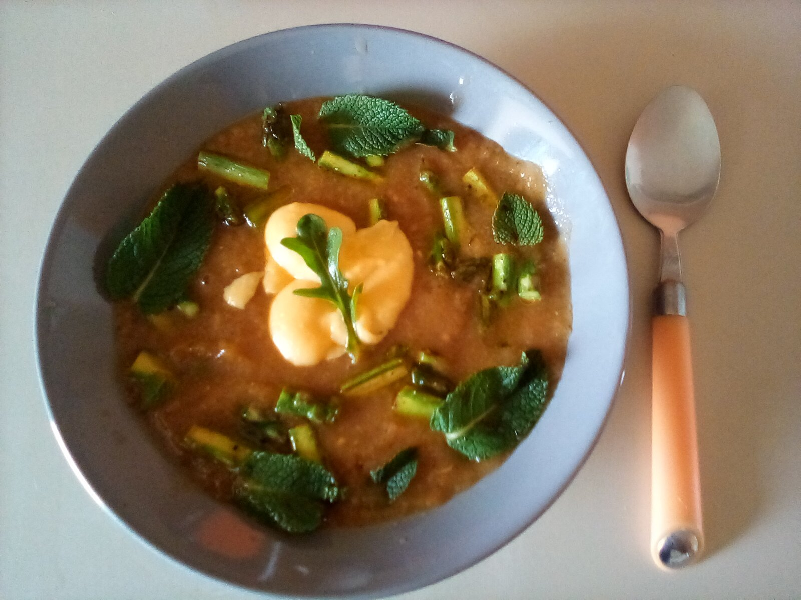
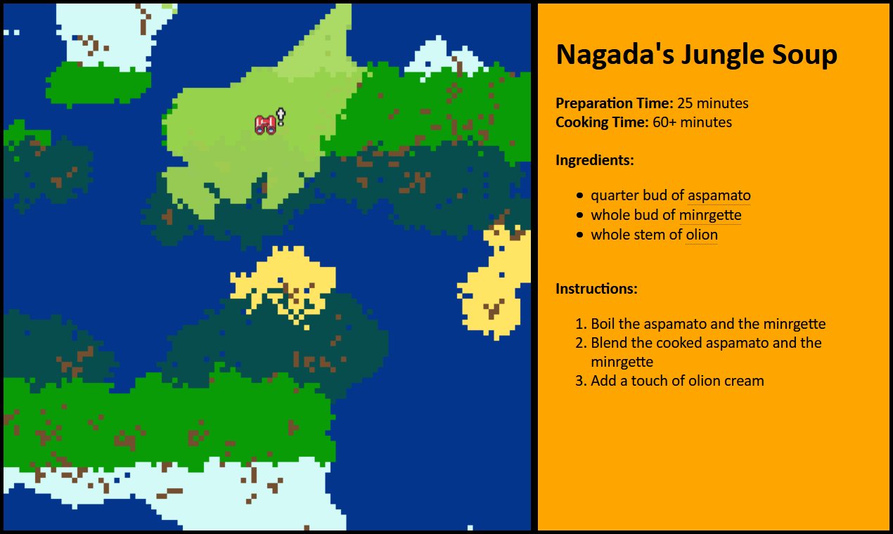

# by [Younès](https://knivesandpaintbrushes.org/younes) / [@pyrofoux](https://twitter.com/pyrofoux/)

## ***Tell Me What You Eat***

 

> "Tell me what you eat, and I will tell you what you are."

— *Jean-Anthelme Brillat-Savarin*

If you want to understand a group of humans — where they live, how they speak, what they value, how they use their time or what they are proud of, a good place to start is with **how they eat**.

We'd like to place the deep bond between food and culture at the heart of an interactive experience: What can you learn from a group of people, based on what they eat?

## *Explore a world through its cookbook*

***Tell Me What You Eat*** is an in-development game where players are invited to discover human cultures living in a fictional world, using their cooking practices as a red thread. If I tell you how they prepare food, can you piece together their history, where they lived, how they spoke, what they loved?

We intend to make ***Tell Me What You Eat*** a sort of *generative detective* game: each time you replay it, the world you explore will be recreated anew. New landmaps, new plants, new populations, new historical events — that will in turn, influence the recipes of this world. You might want to cook one of these recipes yourself, or try to imagine with your friends which kind of world exist around them.

## Prototypes & Experiments

 

Our various prototypes and playful experiments are all available on the [Github repo](https://github.com/Pyrofoux/Tell-Me-What-You-Eat/).

It contains:
- a first rough prototype of generating a fictional world's cookbook
- a tentative at cooking a fictional recipe
- a simulation of how places get their names from the people they are traversed by

